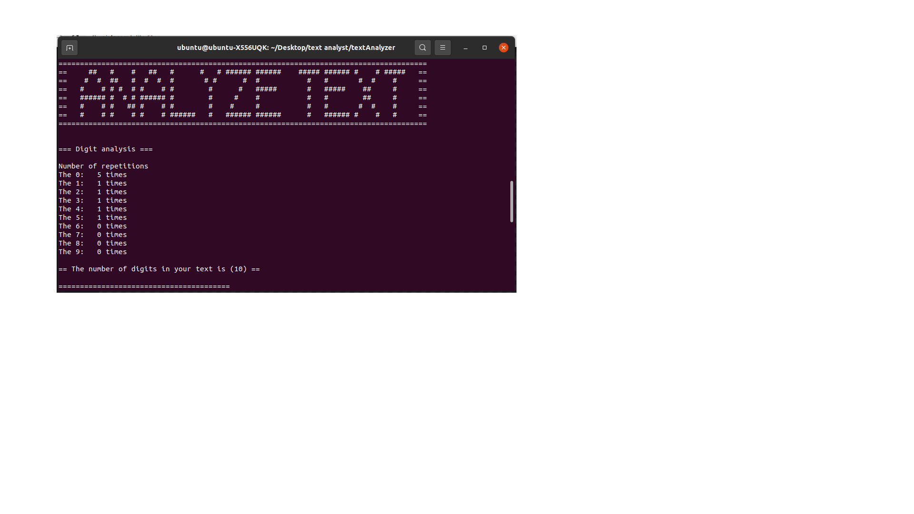
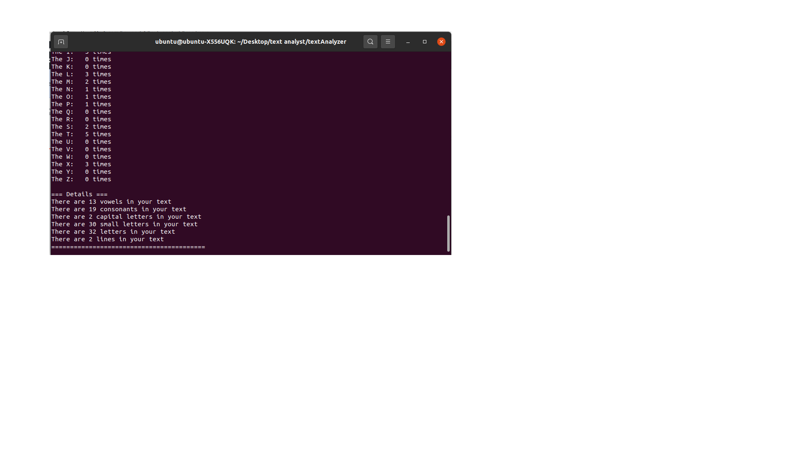

# text_analyst
This is a basic analyst for texts. It analyzes:
- Number of digits
- How often each digit was repeated
- How often each letter was repeated
- Number of vowels in the text
- Number of consonants
- Number of capital letters
- Number of small letters
- Number of all letters
- Number of lines

<h3> Your text should be written in the text file (yourText.txt) and then you can run the program and analyze that text. </h3>

